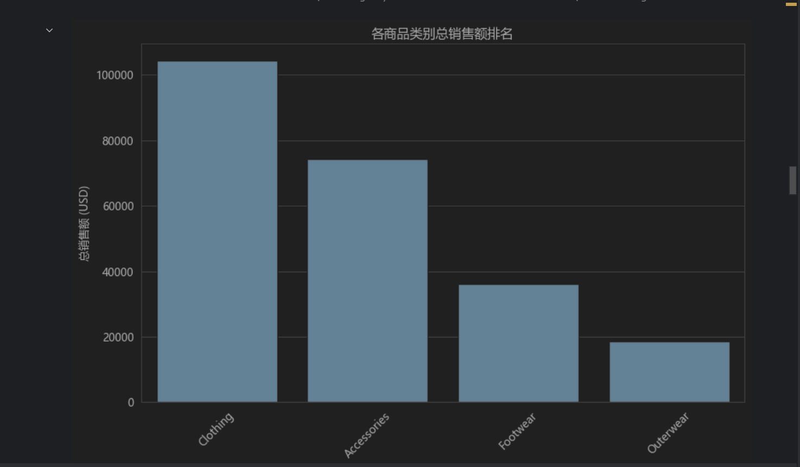

# shopping-trend-analysis
商店购物趋势数据分析（Python）
# 🛍️ 商店购物趋势数据分析

## 📌 项目简介

本项目使用 Python 对 3900 条零售购物记录进行探索性数据分析，从多个维度（年龄、性别、商品类别、季节、评分、运输方式、付款方式、客户分层）揭示消费者行为规律，并为业务决策提供数据驱动的建议。

**项目目标**：通过数据分析识别核心消费群体、高潜力品类和季节性趋势，为精准营销和运营优化提供依据。

---

## 📊 数据概览

- **数据来源**：Kaggle 公开数据集（Shopping Trends Dataset）
- **记录数**：3900 条
- **字段数**：20 列
- **核心字段**：年龄、性别、购买物品、商品类别、购买金额、位置、季节、评分、付款方式、运输类型、客户分层等

---

## 🔍 分析问题

本项目围绕以下 8 个核心业务问题展开分析：

| 序号 | 分析问题 |
|------|----------|
| 1 | 不同年龄段的消费金额差异？ |
| 2 | 男性和女性的消费差异？ |
| 3 | 哪些商品类别最受欢迎/销售额最高？ |
| 4 | 季节与消费金额的关系？ |
| 5 | 评分与消费金额的关系？ |
| 6 | 运输类型与消费金额的关系？ |
| 7 | 付款方式与消费金额的关系？ |
| 8 | 客户分层与消费金额的关系？ |

---

## 📈 核心发现

### 1. 年龄分布
- 顾客集中在 **30-50 岁**，呈单峰分布
- 年龄与消费金额之间**无强相关性**，各年龄段消费能力相对均衡

### 2. 性别差异
- **女性顾客是绝对主力**：人数和客单价均高于男性
- 女性平均消费：**62.31 美元**，男性：**57.21 美元**

### 3. 品类表现
| 品类 | 总销售额（美元） | 订单数 |
|------|------------------|--------|
| **Clothing（服装）** | **104,264** | 1,737 |
| Accessories（配饰）| 74,200 | 1,240 |
| Footwear（鞋类）| 36,093 | 599 |
| Outerwear（外套）| 18,524 | 324 |

- **Clothing 贡献最高销售额**，是核心品类
- Outerwear 销售最低，可能与季节或定价有关

### 4. 季节效应
| 季节 | 平均消费金额（美元） |
|------|---------------------|
| **冬季** | **61.56** |
| 春季 | 60.36 |
| 夏季 | 58.74 |
| 秋季 | 58.41 |

- **冬季消费最高**，秋季最低
- 提示：可在冬季前加大备货和促销力度

### 5. 其他维度
- **评分与消费金额几乎不相关**（相关系数 ≈ 0.031）
- **运输方式**对客单价影响不大（58-61 美元区间）
- **Venmo 和信用卡用户**客单价略高（61+ 美元）
- **现有客户分层（VIP/Loyal/New）未能有效区分高价值客户**，建议重新定义 VIP 门槛

---

## 💡 业务建议

1. **人群策略**：针对 **31-50 岁女性顾客** 进行精准营销
2. **品类策略**：**加大 Clothing（服装）品类** 的库存和推广力度
3. **季节策略**：在 **冬季** 前策划促销活动，提升淡季销售额
4. **客户策略**：**重新定义 VIP 门槛**（基于消费金额 Top 20% 或高频购买），并设计差异化权益
5. **渠道策略**：在 **Venmo 和信用卡用户** 群体中推广高单价商品

---

## 🛠️ 技术工具

- **Python 3.9**
- **Pandas**：数据清洗与处理
- **Matplotlib / Seaborn**：数据可视化
- **Jupyter Notebook**：交互式分析环境

---

## 📁 项目结构
shopping-trend-analysis/
├── shopping_trends.csv # 原始数据集
├── shopping_trend_analysis.ipynb # Jupyter Notebook 分析代码
├── README.md # 项目说明文档
└── images/ # 可视化图表截图

---

## 🚀 如何运行

1. 克隆本仓库
2. 安装依赖：
   ```bash
   pip install pandas matplotlib seaborn
   jupyter notebook shopping_trend_analysis.ipynb
### 各品类销售额排名


### 评分 vs 消费金额


### 各季节平均消费金额

